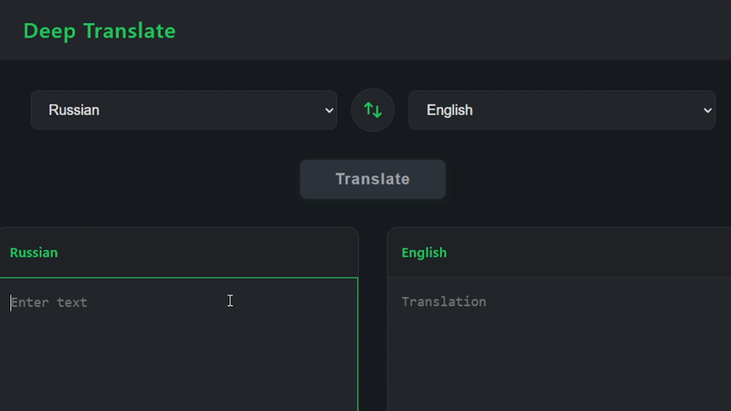

# Переводчик на базе LLM моделе с помощью FastAPI + Streamlit



## Установка и запуск

Сперва потребуется [Docker](https://www.docker.com/)

Клонируем исходный репозиторий

```
git clone https://github.com/EHAT32/ml_team_homeworks.git
```

Заходим в репозиторий проекта:
```
cd translator
```
В папке backend создаем файл .env и добавляем токен с сайта [openrouter](https://openrouter.ai/)

Содержание файла backend/.env:
```
API_KEY=TOKEN
```
Вводим далее команду:
```
docker compose up -d 
```

Сервис разворачивается локально, для его тестирования перейдите по следующему адресу в браузере

```
http://127.0.0.1:8500/
```
